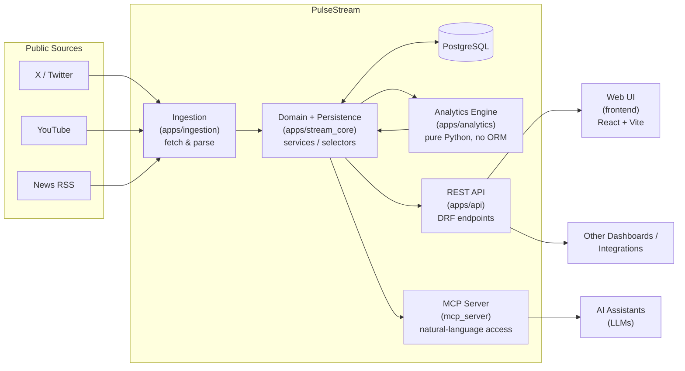

# PulseStream

> An intelligent hub for **sentiment analysis** and **trend detection** across social media and entertainment content.


---

## What is PulseStream?

The internet never stops talking. Millions of people comment on movies, games, brands and public figures every second — far more than any human could ever read.

**PulseStream is a system that listens to that conversation for you.** It continuously collects public posts and comments, cleans and analyzes the text, and answers three questions:

1. **What is being talked about?** — the trending topics right now.
2. **Is the reception positive or negative?** — the overall sentiment.
3. **Is it growing or fading?** — how engagement and sentiment change over time.

The name says it all: **Pulse** (the heartbeat of a topic) + **Stream** (the constant flow of messages).

### Who is it for?

- **Brands** measuring how a product launch is being received.
- **Media & entertainment** gauging audience reaction to a trailer or release.
- **Analysts & investors** tracking public perception of a company or asset.

---

## Architecture

PulseStream is built as a **Modular Monolith** following the **Service–Selector pattern** ([HackSoft Django Styleguide](https://github.com/HackSoftware/Django-Styleguide)), with the data-science layer fully **decoupled from Django/ORM** so it stays pure, portable and easy to test.

Think of it as a factory with an assembly line — raw comments come in one end, useful insight comes out the other:



| Module             | Role                                                                         | Analogy                   |
| ------------------ | ---------------------------------------------------------------------------- | ------------------------- |
| `apps/ingestion`   | Connects to public APIs / scrapers and pulls raw posts                       | The collector at the door |
| `apps/stream_core` | Domain rules: reads (`selectors`) and writes (`services`) to the DB          | The warehouse             |
| `apps/analytics`   | Pure-Python NLP: cleaning, keywords, sentiment, metrics                      | The analyst               |
| `apps/api`         | Django REST Framework endpoints for external consumers                       | The service counter       |
| `mcp_server`       | Model Context Protocol server so LLMs can query the data in natural language | The AI translator         |
| `frontend`         | React + Vite dashboard consuming the REST API                                | The shop window           |

---

## Tech Stack

- **Backend:** Python 3.14, Django, Django REST Framework
- **Frontend:** React 19 + Vite, Tailwind CSS
- **Database:** SQLite today; PostgreSQL is the deployment target
- **Async / Scheduling:** Celery + Redis
- **NLP / Data Science:** pure Python (frequency-based), with spaCy / Hugging Face planned for advanced features
- **Testing:** pytest (Test-Driven Development)
- **Infra:** Docker + Docker Compose
- **AI Integration:** Model Context Protocol (MCP)

---

## Project Status

PulseStream is under **active development**. This section is kept honest — it reflects what actually works today, not what is planned.

**Foundation** ✅

- [x] Modular project structure
- [x] Virtual environment & dependencies
- [x] Django settings & app registration
- [x] Data models (`ContentSource`, `RawPost`, `SentimentAnalysis`)
- [x] Initial database migrations

**Phase 1 — Domain & Persistence** (`stream_core`) ✅

- [x] Selectors (`get_active_sources`, `get_unprocessed_posts`, ...)
- [x] Services (`create_content_source`, `bulk_create_raw_posts`, ...)

**Phase 2 — Ingestion / ETL** (`ingestion`) ✅

- [x] Base adapter interface (`BaseAdapter`) + RSS connector (`RSSAdapter`) · _fully tested_
- [x] Ingestion service (`run_ingestion`) + `POST /api/ingestion/trigger/` endpoint
- [x] Celery task for background sentiment processing (`processar_sentimentos`)
- [x] Dispatch the task after a successful ingestion (`.delay()` from the trigger endpoint)
- [x] Periodic draining of pending posts (Celery Beat, every 5 min)

**Phase 3 — Analytics Engine** (`analytics`) 🚧 _in progress_

- [x] `limpar_texto` — text cleaning (HTML strip + normalization) · _fully tested_
- [x] `extrair_palavras_chave` — keyword extraction (frequency + stopwords) · _fully tested_
- [x] `classificar_sentimento` — sentiment classification, returns `(label, polarity_score)` · _fully tested_
- [ ] Topic modeling
- [ ] Statistical metrics

**Phase 4 — REST API** (`api`) ✅

- [x] Serializers, views & endpoints

**Phase 5 — MCP Server** (`mcp_server`) ✅

- [x] Server init + analytical tools (`listar_fontes`, `resumo_sentimento_fonte`)

**Phase 6 — DevOps & Quality** 🚧 _in progress_

- [x] Test suite (pytest) — analytics, `stream_core`, ingestion & API layers
- [x] Dockerization (`Dockerfile` + `docker-compose.yml`)
- [x] CI: test suite on every pull request (GitHub Actions)
- [ ] CD: automated deploy

**Phase 7 — Web UI** (`frontend`) 🚧 _in progress_

- [x] React + Vite scaffold, Tailwind with semantic colour tokens
- [x] Configured API client + CORS on the backend
- [ ] Dashboard and source-detail screens

---

## Getting Started

> ⚠️ The project is under active development, but the full pipeline runs today: ingestion, background sentiment analysis, the REST API and the MCP server. Docker Compose is the quickest way to get all of it up.

### Running with Docker (recommended)

One command brings up the whole system — no local Python, Redis or virtualenv required.

```bash
# 1. Clone
git clone https://github.com/<your-username>/PulseStream.git
cd PulseStream

# 2. Create the .env file (required — the app will not boot without SECRET_KEY)
cp .env.example .env
python -c "from django.core.management.utils import get_random_secret_key; print(get_random_secret_key())"
# paste the generated key into .env

# 3. Bring everything up
docker compose up
```

This starts four services:

| Service  | Role                    | Where                   |
| -------- | ----------------------- | ----------------------- |
| `web`    | Django app              | <http://localhost:8000> |
| `worker` | Celery worker           | executes the tasks      |
| `beat`   | Celery beat             | schedules them          |
| `redis`  | broker & result backend | port 6379               |

Useful variants:

```bash
docker compose up -d          # detached
docker compose logs -f        # follow the logs
docker compose down           # tear everything down
docker compose up --build     # rebuild after changing requirements.txt or the Dockerfile
```

Source code is mounted as a volume, so editing a `.py` file does **not** require a rebuild.

### Running locally (without Docker)

```bash
# after cloning and creating .env as above
python -m venv venv
venv\Scripts\activate        # Windows
# source venv/bin/activate   # macOS / Linux

pip install -r requirements.txt
python manage.py migrate
python -m pytest
```

The test suite is fully mocked and offline — it needs neither Redis nor network access. Running the app itself, however, needs Redis plus a Celery worker and beat process; see [docs/guia.md](docs/guia.md) for the four-terminal setup.

### Running the frontend

The web UI is a separate React app in [`frontend/`](frontend/), not served by Django.

```bash
cd frontend
npm install
npm run dev          # http://localhost:5173
```

It reads the API base URL from `VITE_API_BASE_URL`, defaulting to `http://localhost:8000`. The backend already allows the Vite dev server origin through CORS, so no extra setup is needed for local development — just keep the backend running in another terminal.

---

## 🔌 MCP Server

`mcp_server/server.py` exposes PulseStream's data to an AI assistant through the [Model Context Protocol](https://modelcontextprotocol.io), so the sentiment data can be queried in natural language.

Two tools are available:

| Tool                                | Returns                                                          |
| ----------------------------------- | ---------------------------------------------------------------- |
| `listar_fontes()`                   | the active content sources — id, name, platform                   |
| `resumo_sentimento_fonte(source_id)` | positive / neutral / negative percentages for one source          |

Try them with the official inspector, from the repo root with the virtualenv active:

```bash
npx @modelcontextprotocol/inspector python mcp_server/server.py
```

The server runs over stdio, so it works with local clients today (the inspector, or Claude Desktop via `claude_desktop_config.json`). Serving it over HTTP for remote clients is on the roadmap.

---

## 🧪 Testing Philosophy

This project treats tests as first-class citizens. The analytics layer is developed with a strict **Red → Green → Refactor** cycle:

1. **Red** — write a failing test that describes the desired behavior.
2. **Green** — write the minimum code to make it pass.
3. **Refactor** — improve the code while the tests keep it safe.

Because the analytics functions are **pure** (same input → same output, no side effects), tests are fast, deterministic, and don't need a database or network.

```bash
python -m pytest
```

---

## Roadmap

The pipeline is complete end to end. What remains, in order of priority:

1. Finish the `analytics` engine — `topic_model.py` and `metrics.py` are still empty.
2. Improve sentiment accuracy: expand the word lists and stopwords ([#15](https://github.com/leozorzii/PulseStream/issues/15)).
3. Spike LLM-based sentiment analysis as an alternative to the lexicon approach ([#16](https://github.com/leozorzii/PulseStream/issues/16)).
4. Expose the MCP server over HTTP, so it works beyond a local stdio client.
5. Move from SQLite to PostgreSQL, and add automated deploy (CD).

---

## 📄 License

This project is licensed under the MIT License — see the [LICENSE](LICENSE) file for details.
